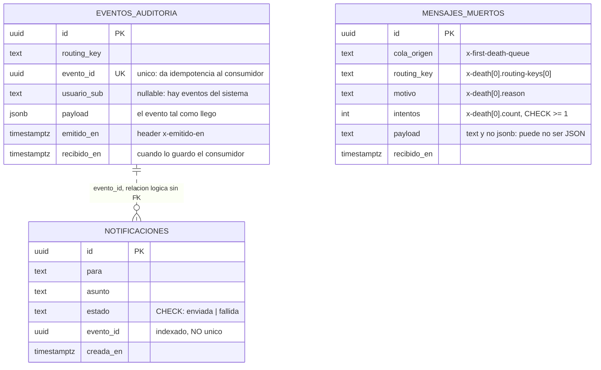
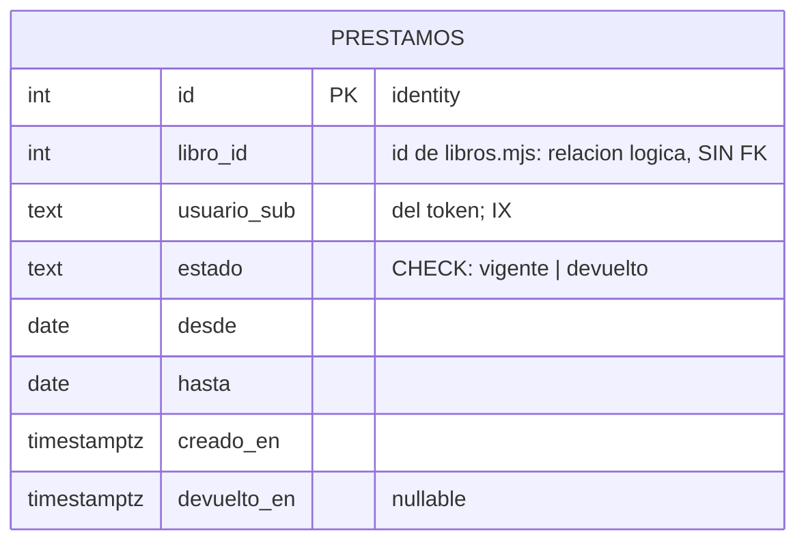

 # Modelo de datos · biblioteca

`biblioteca-eventos` es dueño de estas tres tablas y de ninguna más. Ningún otro servicio las
escribe, y ninguna tiene clave foránea hacia una tabla de otro servicio.

## Decisiones

| Decisión | Motivo |
|---|---|
| Clave primaria `uuid`, e identificador del evento generado por el productor | El `id` de la fila lo pone Postgres (`uuid_generate_v4()`). El `evento_id` no: viaja en el header `x-evento-id` desde el productor y es el mismo en los tres consumidores |
| `UNIQUE (evento_id)` en `eventos_auditoria` | RabbitMQ garantiza *at least once*. La segunda inserción falla con `23505`, el consumidor hace `ack` y no duplica |
| `evento_id` indexado pero **no** único en `notificaciones` | Un mismo evento puede generar más de una notificación legítima |
| Sin clave foránea entre `notificaciones.evento_id` y `eventos_auditoria.evento_id` | La relación es lógica. Una FK obligaría a que la auditoría esté escrita antes que la notificación, y son dos consumidores independientes |
| `jsonb` en `eventos_auditoria.payload`, `text` en `mensajes_muertos.payload` | Lo que llega a auditoría pasó por `JSON.parse`; lo que llega a mensajes muertos puede ser justamente lo que no pudo |
| `timestamptz` en todos los instantes | Guarda el instante absoluto. `timestamp` pierde la zona horaria |
| `CHECK` en `estado` en vez de un enum de TypeScript | El `CHECK` lo aplica Postgres a todo lo que escriba en la tabla, no solo a nuestro código |
| Dos índices, y solo dos | `(routing_key, recibido_en)` y `(evento_id)` son las dos consultas reales. Un índice que nadie usa es escritura más lenta |

## Dueño: prestamos.mjs · esquema prestamos

| Restricción o índice | Por qué |
|---|---|
| `UNIQUE (usuario_sub, libro_id) WHERE estado = 'vigente'` | Un lector no tiene dos préstamos vigentes del mismo libro, y sí puede volver a pedirlo después de devolverlo |
| `ix_prestamos_usuario_sub` | El panel lista los préstamos de un lector |
| Sin FK en `libro_id` | El libro lo sirve `libros.mjs`, que es otro servicio |